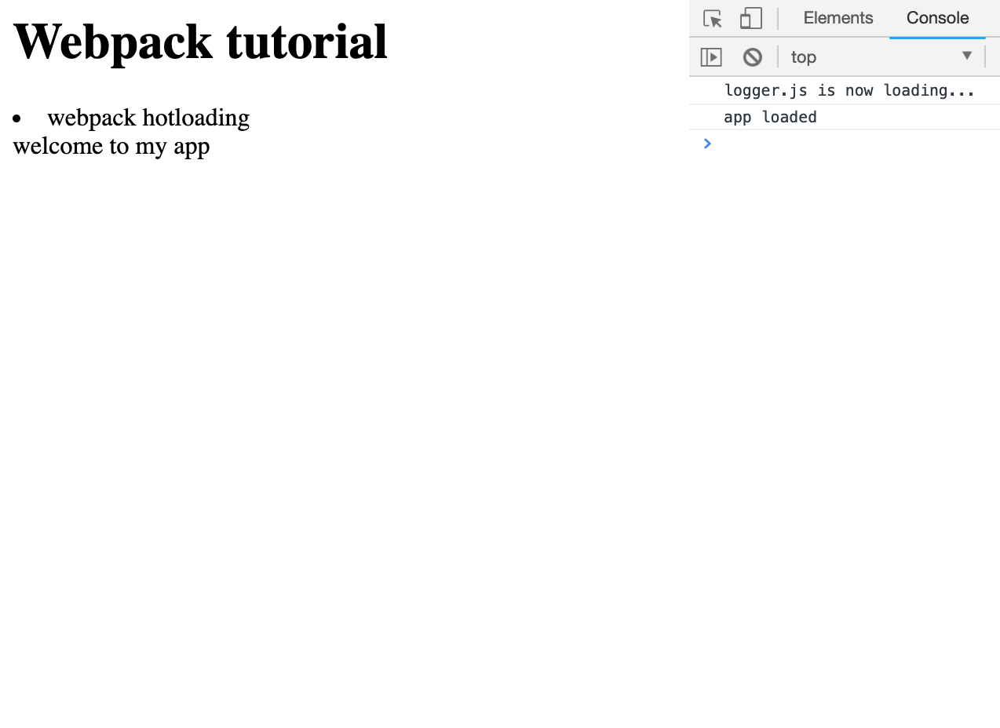

#To use webpack 

[](https://greenkeeper.io/)

```
npm install webpack -g
npm install webpack-cli -g
```

```
npm install webpack --save-dev
```

package.json file : 
```
{
  "name": "xxxx",
  "version": "1.0.0",
  "description": "",
  "main": "app.js",
  "dependencies": {},
  "devDependencies": {
    "webpack": "^4.29.6",
    "webpack-cli": "^3.2.3"
  },
  "scripts": {
    "test": "echo \"Error: no test specified\" && exit 1",
    "dev": "webpack --mode development", #for development
    "build": "webpack --mode production" #for production
  },
  "author": "",
  "license": "ISC"
}

```

## app.js
```
document.write('welcome to my app');
console.log('app loaded');
```

## index.html

```
<html>
  <body>
    <script src="bundle.js"></script>
  </body>
</html>
```

# Webpack Dev Server

using webpack server to run the app

```
npm install webpack-dev-server -g
```

```
webpack-dev-server
```

## remove hot loading bar 
```
webpack-dev-server --inline 
```

